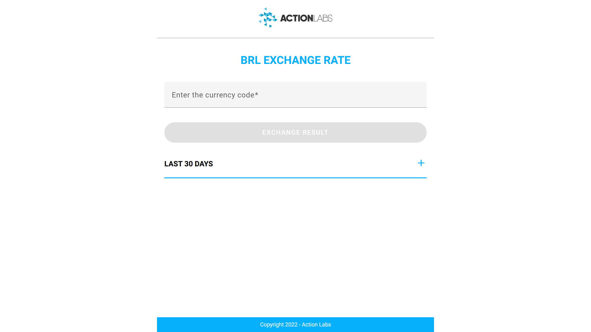
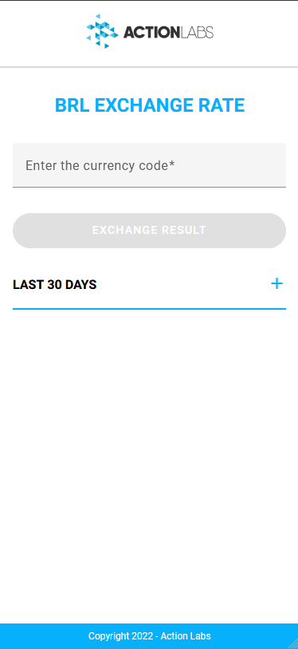
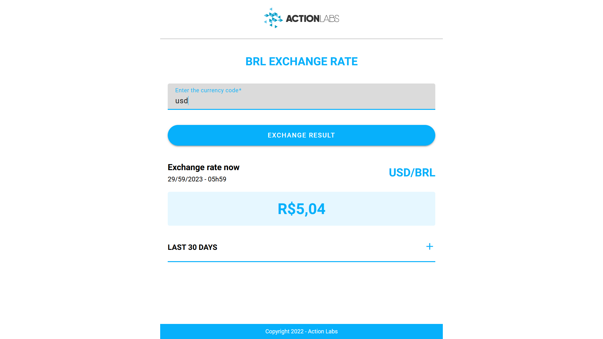
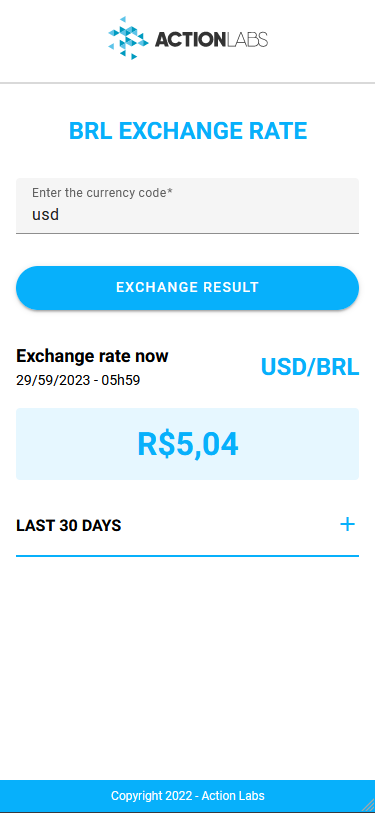
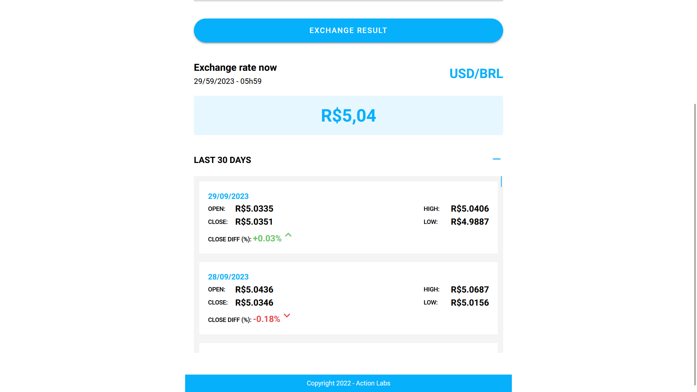
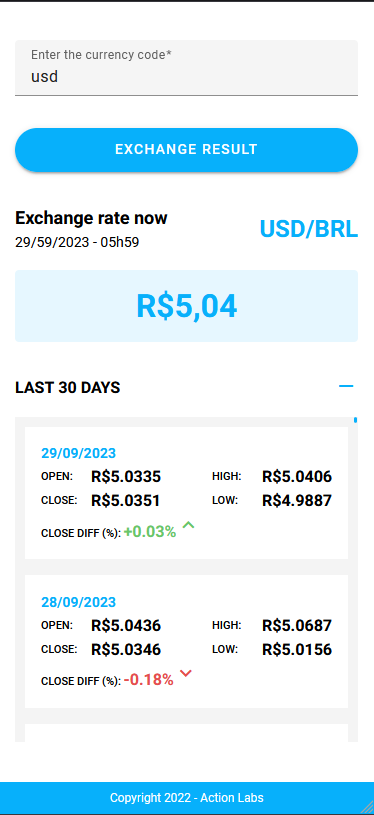

# Brl Exchange Rate

Projeto desenvolvido para um teste de código onde forneceram uma API com dois endpoints GET, um retornaria o valor atual de alguma moeda, em comparação com o Real(BRL), e o outro retorna o valor dos últimos 30 dias desta moeda em comparação com o Real(BRL)

# Layout

## Início do APP

[]()

## Início do APP para Mobile

[]()

## Após pesquisar uma moeda

[]()

## Após pesquisar uma moeda para Mobile

[]()

## Parte de listagem dos últimos 30 dias aberta

[]()

## Parte de listagem dos últimos 30 dias aberta para Mobile

[]()

## Tecnologias utilizadas

- Angular v15
- Angular Material v15
- Angular Forms
- RxJS

## Rodando Localmente

```bash
$ git clone git@github.com:Joas-Assuncao/brl-exchange-rate.git

$ cd brl-exchange-rate

$ npm install ou yarn install

$ npm start ou yarn start ou ng serve
```
